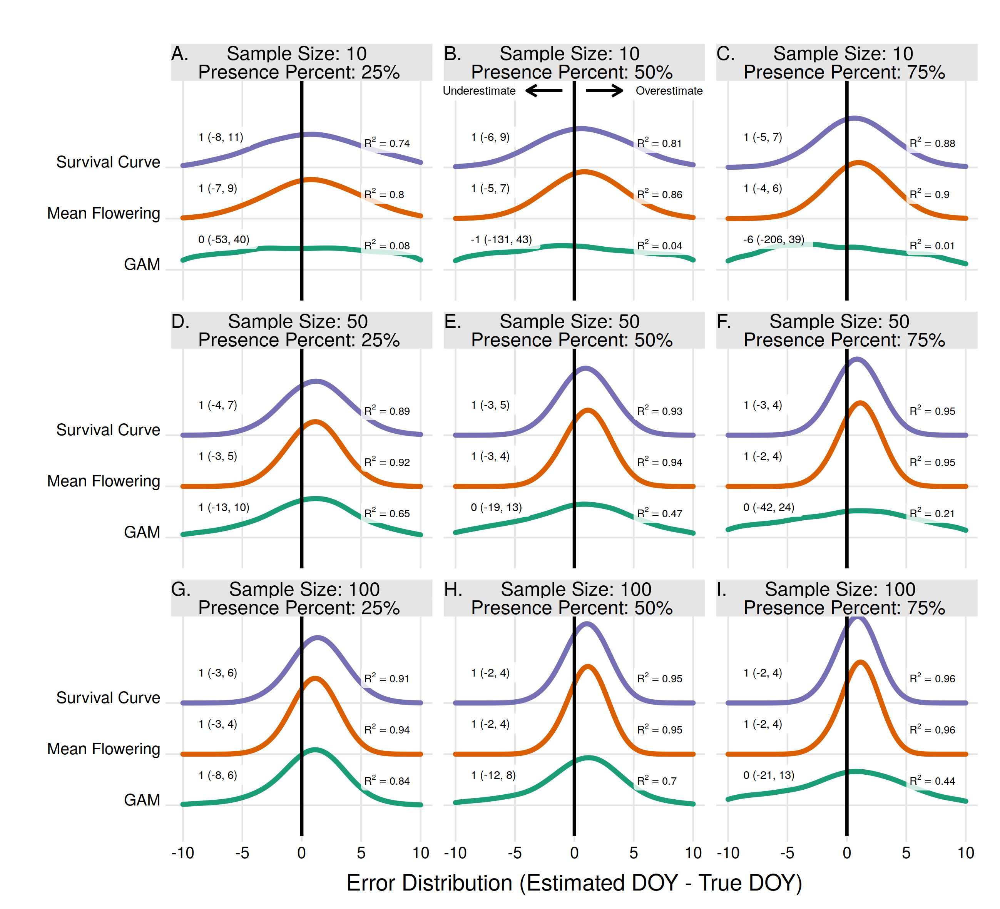
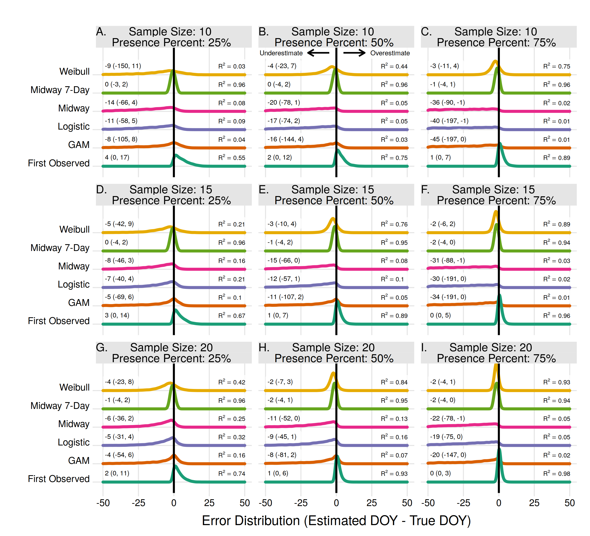

\raggedright

$^1$ School of Natural Resources and Environment, University of Florida Gainesville, FL, United States

\newpage

# Abstract

The scale of phenology research has expanded due to the digitization of herbarium specimens and volunteer based contributions. These data are status-based, representing the presence or absence of a specific phenophase. Modelling the progress of plant dormancy to growth and reproduction and back to dormancy requires estimating the transition dates from these status-based observations. There are several methods available for this ranging from statistical moments using the Julian day to newly introduced methods using concepts from other fields. Comparing the proficiency of different estimators is difficult since true transition dates are rarely known. Here I use a recently released dataset of flowering observations where, due to high sampling frequency and unique physiology, the transition dates of onset, peak, and end of flowering are known. I used a Monte Carlo analysis to test estimators across two scales using a range of sample sizes and proportion of flowering presence observations. I tested estimates of onset, peak, and end of flowing for at the population level, and estimates of onset and end for individual plants. Overall a recently introduced method using a Weibull curve performed the best for population level onset and end estimates, but other estimators may be more appropriate when there is a large amount of absence observations relative to presence observations. For individual estimates a method using the midway point between the first flower presence and most prior flower absence, within 7 days, is the best option as long as the restriction does not limit the final sample size. Otherwise the Weibull method is adequate for individual estimates as well. 

Keywords: onset, peak, flowering, budburst, sampling frequency, herbarium records, GAM

# Introduction
Plant phenology has a long history in ecological research and is a primary indicator of climate change [@chuine2017; @scheffers2016]. Studies commonly document the long-term trends of the first flower or leaf out dates, apply various modelling approaches to infer the drivers of these transitions, or make forecasts using future climate conditions. Phenology models, such as predictive models or those used for long-term trends, use the transition dates as the variable of interest. Common transition dates are first observed open flowers or new leafs on a plant, but can also include peak flower, fruit maturation, and leaf senescence. Historic datasets often use repeated observations to identify the true transition date [@davis2015; @wolkovich2012], yet this is susceptible to observer bias [@miller-rushing2008]. Most modern studies and collection protocols use status-based monitoring, where observers record the current state of a plant (ie. leaves present or absent) without necessarily conducting repeated observations to observe recent or future transitions. This includes research using herbarium records, where the presence or absence of flowers and other phenophases is inferred from their presence on a specimen [@willis2017]. To make use of status-based data in most phenology models the transition date must first be estimated, and there are several methods available.

Two of the most common estimators are the first observed and mean occurrence day methods, where either the first observation in a year or the mean Julian day for all observations within a year is used as an estimate for a phenophase transition and peak dates, respectively [@willis2017]. The first observed method has been shown to be biased in several instances, while the mean occurrence date is considered a reliable estimator for the midpoint or peak of a phenophase [@miller-rushing2008; @moussus2010; @bertin2015]. Recently more robust methods have been introduced. -@templ2017 used survival modelling to estimate the median date of flowering and -@pearse2017 used an extinction model to estimate the first flowering date. Both of these methods were more reliable than other methods. Using repeated observations of individual plants, as opposed to observations across a population, site, or region, allows for more reliable estimates. For example if flowers are not present during one visit but present during the next, the transition of flowers opening is constrained to the window between the two visits [@gerst2016]. Studies of bird migration phenology face similar challenges and several estimators have been used to model the first arrival dates. Examples include logistic regression [@mayor2017] and General Additive Models (GAMs) [@moussus2009; @newson2016; @linden2017]. To date no comparison has been made of these different transition date estimators for plant phenology. 

Furthermore, there are no clear guidelines for using estimators across different scales. Over a latitudinal gradient the transition of a phenophase for a single species can last several weeks to months, and even at the local scale can vary due to many factors [@diez2012; @zhang2017]. Studies which estimate transition dates have combined observations from individual plants [@gerst2016; @taylor2018b], sites or populations of plants [@schaber2002; @linkosalo2008; @basler2016], or entire regions [@calinger2013; @park2014]. How different phenology estimators perform across scales is currently unknown. 

A comparison of estimators is difficult since, due to infrequent sampling, the true date of transitions is rarely known. Previously -@moussus2010 used simulated data to test the ability of different estimators to detect the shifts in phenology distributions. Here I compare several estimators using a recently published dataset where, due to the unique physiology of the focal species, transition dates and other metrics are known. I compared estimators across two different scales (population and individual level transition dates), with varying sample sizes, and with varying proportions of observed flower presence.

# Methods

## Phenology Data

I used phenology observations of the perennial forb *Echinacea angustifolia* collected in Minnesota, U.S.A. in the years 1995-2015 [@waananen2018a; @waananen2018b] to test the accuracy of different transition date estimators. The sampling frequency was at most every 3 days during the growing season. The flowering of *E. angustifolia* is such that the true start date of flowering can be inferred very precisely for an individual plant. The flowering heads of *E. angustifolia* consist of 80-250 disk flowers in several rows. The bottom most row flowers first, with each adjacent row flowering every day afterwards. This pattern is used to determine the exact date of first flowering for an individual [@wagenius2004]. With this information the true start and end date of flowering for the entire population can be determined even without daily sampling. 

For each year I calculated the following population-level metrics from the phenology observations: 1) The start of flowering as defined by the Julian day of the first observed flower, 2) peak flower defined as the Julian when the most flowers were observed in a given year, 3) the end of flowering as defined by the last day a flower was observed. I also calculated two  individual level metrics: 1) the start and 2) end day of flowering for each individual plant in each year. 

To simulate status-based data of a plant population I randomly sampled observations of plants from throughout the year, thus an observation could be of flowers present or absent. Flowering absence observations are possible throughout the year as no individual flowers for the full duration of the season. I performed a Monte Carlo analysis, where for every year I repeated this 1000 times with varying sample sizes (10, 50, and 100 observation) and varying levels of flowering presence being observed (25%, 50%, and 75%). For example, with flowering presence set to 25% using 100 observations only 25 observations were allowed to be of flower presence while the rest were of flower absence, all being randomly chosen from the full calendar year. The variation in sample size and ratio of flowering presence observations simulate patterns seen in non-systematic phenology datasets, such as the those from herbarium records or volunteer contributions. These patterns stem from biases in the time of year of sampling, infrequent or sporadic sampling, or variations in observer effort [@dickinson2010; @willis2017]. 

For individual level flowering estimates I performed the same random sampling routine for every individual in every year using sample sizes of 5, 10, and 20 observations, and flowering presence ratios of 25%, 50%, and 75%. I only used individuals which were in flower for more than 20 days, since below that there would not be enough data in the lowest sample size and flowering presence classes. I repeated this 20 times for each individual in every year in the Monte Carlo analysis. 

Each estimator, described below, was fit to each random sample. For the population estimates this resulted in 11,000 estimates for each estimator, and sample size/flowering presence combination. For the individual estimates this resulted in 2420 estimates for each estimator and sample size/flowering presence combination. Estimators were compared using the R\textsuperscript{2} value between estimated and observed dates of metrics, and by plotting the density of absolute errors from all Monte Carlo estimates.

## Estimators

The first observed method uses the earliest Julian day of flowering as the estimate for the start of flowering. Analogous to this is the last observed day for estimating the end of flowering. These were used in both the population and individual level analysis.  

The midway method uses the midway point between the first observed flowering date and the most recent observation of flowering absence for an individual plant. This can be improved by applying a restriction whereas only individuals with an observed absence within 7 days of the first observed presence are used [@gerst2016]. Applying this restriction reduces the final sample size available for modelling though. The midway method was used to estimate onset and end in the individual analysis (Midway and Midway 7-Day), and in the population analysis by using the mean onset date from all individuals (Mean Midway and Mean Midway 7-Day). For all cases I noted the rate at which this could not be calculated due to inadequate sampling (ie. if no individuals have an absence observation within 7 days prior to the first presence, than no estimate can be made). 

The Weibull method fits a Weibull distribution to only the flowering presence observations. The estimated date of first flowering is the sum of the dates of all flowering weighted by the joint Weibull distribution [@pearse2017]. This was used for both population and individual level estimates. Code for this was obtained from -@pearse2017 and is provided in the code repository. 

The Logistic method fits a generalized linear model to both presence and absence observations using a binomial distribution, where the Julian day was used to explain the presence or absence of flowering (glm(flowering ~ julian_day, family=binomial)). Prior to fitting all flowering absence observations after the last observed flowering presence were excluded. The expected probability of observing a flower was calculated for all days 1-365, and the estimated onset of flowering was the first day in the season in which the expected probability was 0.05 or greater. The inverse of this is used to estimate the end of flowering. All absence observations prior to the first observed flowering date were excluded, the expected probability was calculated for all days 1-365, and the first day where the probability of flowering falls below 0.05 was the estimate for the end of flowering. This method was used in both the population and individual level analysis. 

The GAM method is unique in that it can potentially estimate the full flowering phenology for a season (onset, peak, and end). Similar to the Logistic method, a general additive model was fit with a binomial distribution and Julian day explaining the presence or absence of flowers, where the Julian day was a thin plate regression spline (gam(flowering ~ s(julian_day, bs=’tp’), family=binomial)). The expected probability of flowering was calculated for all days 1-365. The estimated onset date was the first day in which the probability was 0.05 or greater. The estimated peak flowering date was the Julian day with the maximum probability in a given year. The estimated end of flowering was the first day, after the peak, in which the probability was 0.05 or less. This method was used for estimating onset and end in both the population and individual level analysis, and for estimating peak flowering in the population analysis. 

The Survival method uses a Kaplan–Meier model to estimate the median date of “death” from observations of individuals being alive or dead at different times, where flowering presence and absence are analogous to alive or dead, respectively [@templ2017]. I used the survfit function in the R package survival using right censoring [@Rsurvival]. This method was used to estimate peak flowering in the population analysis. 

Finally, the mean flowering method uses the average Julian day of all flowering presence observations. This was used to estimate peak flowering in the population analysis. 

All analysis was done using the R programming language [@rcitation]. Packages used during the analysis included dplyr [@dplyr], tidyr [@tidyr], ggplot2 [@ggplot2], mgcv [@mgcvGAM, @mgcvTP], survival [@Rsurvival], testthat [@testthat], ggridges [@ggridges], and lubridate [@lubridate].

\newpage

|                                  | Population       |                  |                  | Individual       |                  |
|----------------------------------|------------------|------------------|------------------|------------------|------------------|
|                                  | Onset            | Peak             | End              | Onset            | End              |
| First/Last Observed              | $\checkmark$ *p* |                  | $\checkmark$ *p* | $\checkmark$ *p* | $\checkmark$ *p* |
| Midway / Midway 7-Day            |                  |                  |                  | $\checkmark$     | $\checkmark$     |
| Mean Midway /  Mean Midway 7-Day | $\checkmark$     |                  | $\checkmark$     |                  |                  |
| Weibull                          | $\checkmark$ *p* |                  | $\checkmark$ *p* | $\checkmark$ *p* | $\checkmark$ *p* |
| Logistic                         | $\checkmark$     |                  | $\checkmark$     | $\checkmark$     | $\checkmark$     |
| GAM                              | $\checkmark$     | $\checkmark$     | $\checkmark$     | $\checkmark$     | $\checkmark$     |
| Survival                         |                  | $\checkmark$     |                  |                  |                  |
| Mean                             |                  | $\checkmark$ *p* |                  |                  |                  |
|                                  |                  |                  |                  |                  |                  |
|                                  |                  |                  |                  |                  |                  |
|                                  |                  |                  |                  |                  |                  |
Table: Estimators used in this analysis. *p* indicates the estimator uses only presence observations as opposed to both presence and absence observations.

# Results

## Population Onset Estimates

For population level flowering onset the Weibull method produced estimates with the lowest error for most scenarios (Fig. 1). Excluding the scenario where the proportion of flowering presence was 25% and with a sample size of 10, the Weibull method had R\textsuperscript{2} values from 0.33 - 0.79 and median error rates of 3-4 days. With a flowering proportion presence of 25% and sample size of 10 the First Observed method had the highest R\textsuperscript{2}, but still overestimated the true dates by 11 days on average.  

The logistic method had the highest R\textsuperscript{2}, and similar median errors to the Weibull method, when the sample size was high (50-100) and ratio of flowering presence low (0.25). As the proportion of flowering presence increased, and relative amount of absences decreased, the logistic method tended to perform worse by increasingly underestimating the onset date (Fig. 1).

The Mean Midway and GAM methods were never the best performing methods for estimating population onset. The Mean Midway method did not improve by increasing the sample size or by increasing the proportion of flowering presence observations.

Results from the Mean Midway 7-Day method using a sample size of 10 were excluded due to less than 1% of random samples resulting in a usable estimate. This was due to the requirement of each individual plant having at least one presence and one prior absence observation. The usable number of estimates for the remaining scenarios ranged from 2-10% (Fig. S1). With a sample size of 10 the GAM method only produced estimates 27-81% of the time because of too few absence observations, and 100% of the time in all other scenarios. 

## Population End Estimates

The end of flowering for the entire population was more difficult to estimate than the onset of flowering. The highest R\textsuperscript{2} for a given scenario in estimating population onset was always higher than the same scenario in population end estimates. For end estimates the Weibull method had the highest R\textsuperscript{2} in 4 of 9 scenarios, including all three scenarios where the proportion of flowering presence was 75%, as well as when the proportion was 50% with a sample size of 10 (Fig. 2). With a sample size of 50 and 100 and a presence proportion of 50% the Logistic method had the highest R\textsuperscript{2}. With a sample size of 50 and 100 and a presence proportion of 25% the GAM method had the highest R\textsuperscript{2}. 

With a sample size of 10 and presence proportion of 25% the last observed method had the highest R\textsuperscript{2}, but still underestimated the end date of flowering by 17 days the majority of the time (Fig. 2). The Midway method, both with and without the 7-day restriction, were never the best performing estimators. Without the 7-day restriction the method consistently overestimated the end date. With the 7-day restriction the method consistently underestimated the end date. Neither Midway method improved with either increasing sample size or increasing proportion of flowering presence. As in the population onset the results from the Mean Midway 7-Day method were excluded due to less than 1% of estimates being usable, and the GAM method had a low proportion (27-81%) of usable estimates with a sample size of 10 (Fig. S1).

## Population Peak Estimates

All three methods to estimate peak flowering had median error rates of 1 day except in one instance, using the GAM method for a sample size of 10 and proportion of flower presence 75% (Fig. 3). The Mean Flowering method had the highest R\textsuperscript{2} in all scenarios except two where it had R\textsuperscript{2} equal to the Survival Curve method. For the Mean and Survival Curve methods, errors improved with both increasing sample size and increasing proportion of flowering presence. For the GAM method errors improved with increasing sample size, but worsened with increasing proportion of flowering presence. 

## Individual Onset Estimates

For individual plant onset estimates the Midway 7-Day method performed the best in 7 of 9 scenarios. In two scenarios, when the sample size was 15 and 20 with a proportion of flowering presence observations of 75%, the First Observed method had slightly higher R\textsuperscript{2} and lower median error rates than the Midway 7-Day method (Fig. 4). The Midway 7-Day method was able to produce usable individual estimates only 3-17% of the time due to its restrictive nature, while the Midway method produced usable estimates 70-100% of the time (Fig. S2).

The Weibull, Midway, Logistic, and GAM methods never produced the best estimate for any scenario in estimating individual plant flowering onset. The Weibull method did improve with increasing sample size and increasing proportion of flowering presence. Though, since the Weibull method does not use absence observations, increasing the flowering proportion effectively just increases the sample size. At effective sample sizes of 10 or more the Weibull method produced estimates only slightly worse than the Midway 7-Day and First Observed method. The Midway, Logistic, and GAM methods improved slightly with increasing sample size but worsened with increasing proportion of flowering presence. 

## Individual End Estimates

The errors from individual end estimates were nearly identical to individual onset errors, thus the model performance outcomes were the same. Individual end errors are supplied in the supplement (Fig. S3). 

# Discussion

This comparison of phenological estimators using a dataset with known onset, peak, and end of flowering dates confirmed known bias in some estimators and shows the strength of newer ones. Overall the Weibull method predominately outperformed all other methods for estimating the onset and end of flowering populations. The Mean Flowering method produced better, or equal, estimates than other methods for flowering peak. The Midway 7-Day method outperformed other methods in estimating onset and end of individuals flowering, albeit with limitations on the usable sample size. Exceptions to these stem mainly from differences in sample size but also the shape of the flowering distribution.

The Weibull method was the best overall for estimating population onset and end with two exceptions. First, when the total number of flowering presence observations were extremely low (ie. with a total sample size of 10 and percent presence observations 25%) using just the first or last observed flowering date produced better estimates. The first and last observed date have been shown to be biased [@miller-rushing2008; @moussus2010; @bertin2015], yet here it produced the best estimate for these low sample size scenarios. This is due more to the lack of information in this scenario than to any advantage in using first (or last) observed method. This method had an R\textsuperscript{2} value of 0.28 for onset and 0.15 for end estimates in the above-mentioned scenario. With the best estimator having such low explanatory value in this scenario it’s recommended to not estimate flowering onset with extremely low sample sizes. With the highest sample sizes the first and last observed method produced similar results to the Weibull method. Yet this similarity might decrease for species or phenophases which last longer (the population flowering duration here was 39.7 ±6.1 days) or for larger populations, which will have a longer flowering duration [@miller-rushing2008]. As a phenophase lengthens, the chance of observing an individual near the onset or end of the phenophase decreases. Thus the Weibull method would be preferable even with a large sample size. 

Second, using a large sample size (50-100) and a small proportion of flowering presence the Logistic or GAM methods performed slightly better than the Weibull method. This suggests the Logistic and GAM methods effectively utilize flowering absence observations, but require a large amount of them, relative to presence observations, to accurately describe the phenology. Both Logistic and GAM methods performed worse as the proportion of flowering absences decreased, regardless of metric or sample size. The reduction in accuracy was due to increasingly underestimating the onset, and increasingly overestimating the end, as the proportion of flowering absences decreased. If a large amount of flowering absence observations are available then these two methods should be explored for estimating phenology metrics. Absence observations are rare in herbarium-based phenology datasets due to a bias toward growing season sampling [@rich1992; @daru2018], but more common in datasets with status-based protocols [@denny2014; @elmendorf2016]. Given that flowering absence observations could prove useful when presence observations are low, absence observations should be emphasized in data collection efforts.  

For estimating the peak of flowering populations the mean flowering method consistently produced the best estimate, even when sample size and proportion of flowering presence was low, 10 and 25%, respectively. This method has the advantage over the Survival Curve and GAM method of not requiring flowering absence observations. As noted in other studies the mean flowering method is a reliable method for estimating peak flowering [@miller-rushing2008; @moussus2010; @bertin2015].

For estimating the start and end of flowering for individual plants the Midway 7-Day method was the best in most cases. The Weibull method performed similarly when the absolute number of flowering presence observations was greater than 10. It must be noted that in the vast majority of cases (83-97% depending on the scenario, Fig. S2) it was not possible to use the Midway 7-Day method due to lack of individuals with an absence observation within 7 days of the first presence observation. With large enough datasets using this method is still possible even with the restriction [@gerst2016], and it can also be relaxed with a 15 or 30 day minimum to increase sample size if needed [@taylor2018b]. If an insufficient number of individuals results from applying the restriction using the Midway method, then the Weibull method is preferable given enough flowering presence observations.

While the Midway 7-Day method was the best for estimating flowering for individual plants, using the mean of those estimates from a population (Mean Midway 7-Day) did not provide the best population level estimates even with a large sample size. The onset of *E. angustifolia* flowering for individuals is staggered over time [@ison2014] and the mean of these start times is not equivalent to the absolute population onset date. Furthermore the Mean Midiway 7-Day method requires repeated observations of the same individuals, which is not available in herbarium or opportunistically collected phenology data. For population level estimates other methods discussed here are superior. 

-@moussus2010 found GAM’s to be among the best estimators for detecting phenological shifts among different seasons, yet here the GAM method was not the best performing in pinpointing exact transition and peak dates. Differences in analysis include -@moussus2010 using a poisson distribution to model simulated count data, while here I used a binomial distribution to model actual presence/absence data. Here the accuracy of the GAM method decreased as the proportion of absence observations decreased. This could be due to the probability threshold for both onset and end being set to 0.05 and it's possible this threshold could be adjusted to reflect different sampling proportions. It is also possible that the output for the GAM model used here, the probability of observing a flower, is not analogous to the total abundance of flowers. General additive models have substantial flexibility [@wood2017; @simpson2018; @pedersen2018] and further exploration into their use for plant phenology would be beneficial. 

The shape of the flowering distribution affected the proficiency of the estimators. The number of *E. angustifolia* flowers observed over time resembles a skewed distribution, with a quick onset, peak, and gradual decline in number of flowers. The long tail made end estimates more difficult as the probability of observing a flower close to the true end was low. The best performing estimators also tended to overestimate onset and underestimate end of population flowering, as the majority of randomly sampled observations came from the center of the flowering period. The likeness to a normal distribution allowed for very accurate estimates of peak flowering using the Mean Flowering method. Flowering distributions for most species are thought to have similar properties [@forrest2010], but the methods used here may not be appropriate for other phenophases, especially ones which can last significantly longer (ie. leaves lasting several months on the tree). Flowering is also expected to have non-uniform shifts from changing drivers [@ogilvie2017a; @theobald2017]. Other phenophases which do not have a distinct transition or cannot be easily modelled using presence and absence, such as fruit maturation, may not be well described by the methods used here. In these cases models integrating the continuous cycle of phenology would need to be developed [@chuine2017].  

The outcomes for estimating the end of individuals flowering was essentially identical to estimates for the onset. The flowering of an individual *E. angustifolia* plant over time approximates a uniform distribution. Thus, unlike the skewed population flowering over time, estimators for the onset and end of individuals perform equally. This may not be the case when the study species are larger in size and/or contain numerous flowers which can be counted. In these cases the phenology over time may be more similar to a population, with a flowering peak and potentially skewed distribution (while *E. angustifolia*, being in the family Asteraceae, has numerous florets, here I treated the flowering head as a single unit).

This analysis used data from two scales at a single site, yet phenology studies and datasets commonly expand to regional and continental scales [@willis2017]. At large scales the phenology of a single species extends over several weeks to months due to latitudinal gradients in climate. Even within this gradient the phenology is complex and non-linear due to elevation, regional and local climates, and other drivers [@diez2012; @park2014; @zhang2017; @prevey2017]. In future novel climates species will experience non-uniform shifts in their phenology, again due to regional differences in climate forcing [@jeong2013]. It is unclear how combining observations from across an environmental gradient affects transition date estimates, or even what the true value would be given perfect information. Thus, estimators should be used with caution when combining data beyond a single population or site.

In summary I have used a precise flowering phenology dataset to confirm that naively using the first flowering observation is biased, and estimates using the mean flowering reliable for estimating. I have also shown how the recently introduced Weibull method can produce reliable estimates given an adequate sample size, and that the Logistic and GAM methods can be used when the total sample size is high but actual flowering presence observations are low. Additionally, estimating transition dates of individual plants is best done with the Midway method using a 7 day restriction, and the Weibull method if the restriction results in a low number of final samples. These estimators are needed for translating status-based phenology data into distinct transition dates, which are the variable of interest in most phenology research. 

# Acknowledgements
This research was supported by the Gordon and Betty Moore Foundation’s Data-Driven Discovery Initiative through Grant GBMF4563 to Ethan P. White. I thank A. Waananen and the team of the Echinacea Project ([http://echinaceaproject.org/](http://echinaceaproject.org/)) for providing the phenology data set.

# References

