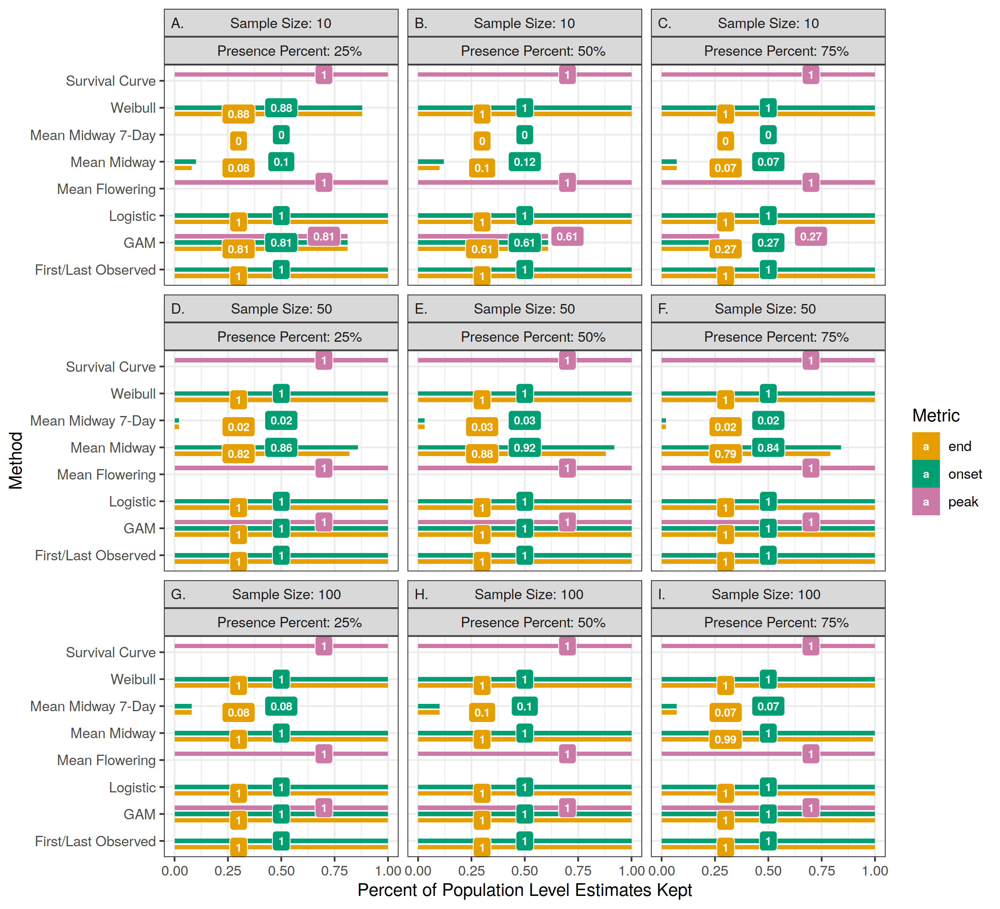
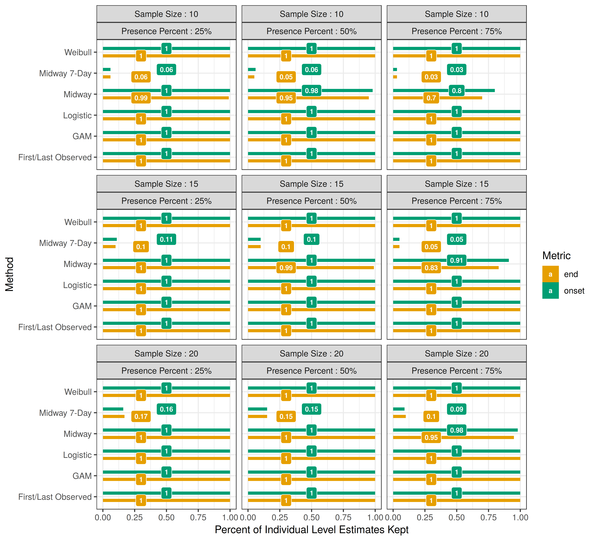
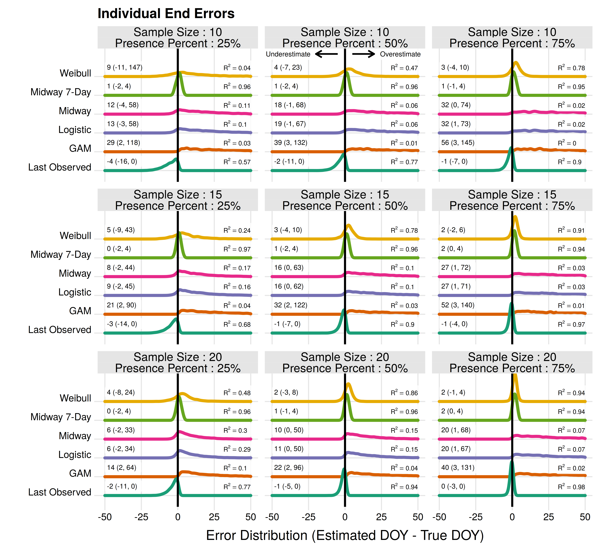

# Estimating transition dates from status-based phenology observations: a test of methods

Shawn D. Taylor

Supplemental Images S1-S3

\newpage

Figure S1: For all population level analysis, the proportion of estimates which were usable for each estimator method. Randomly drawn sets of observations may not be usable due to filtering (ie. requiring an absence observation within 7 days of a presence observation) or due to lack of convergence in the models. 

\newpage

Figure S2: As in Figure S1, but for all individual level analysis. 

\newpage

Figure S3: The error distribution of all estimators for individual flowering end. Text values represent the median error and the 95% quantile range in parenthesis.